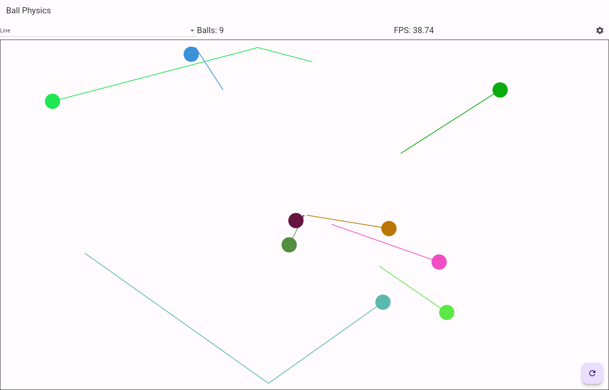
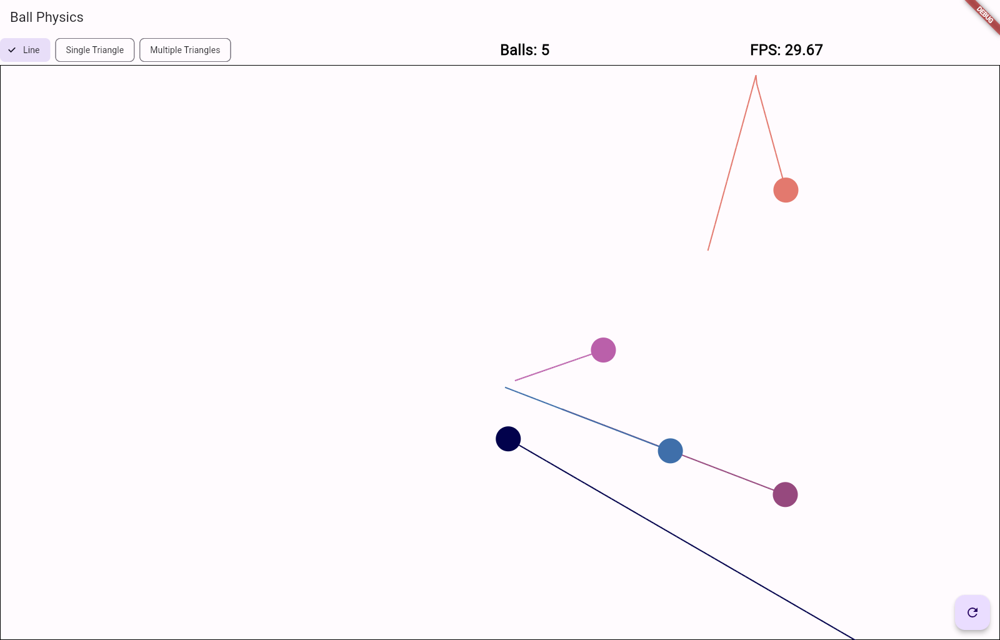
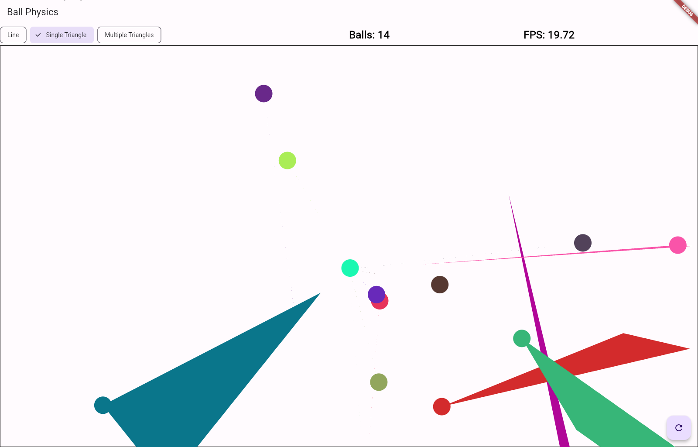
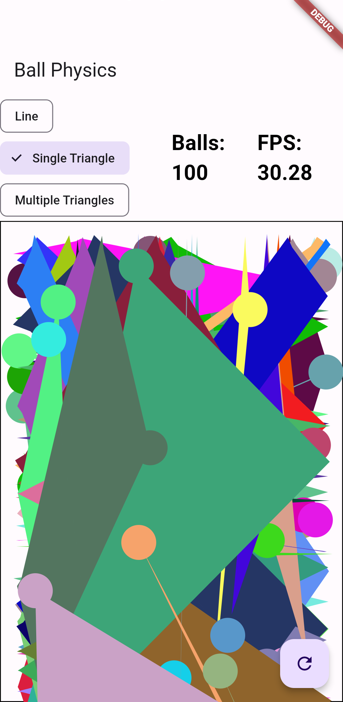
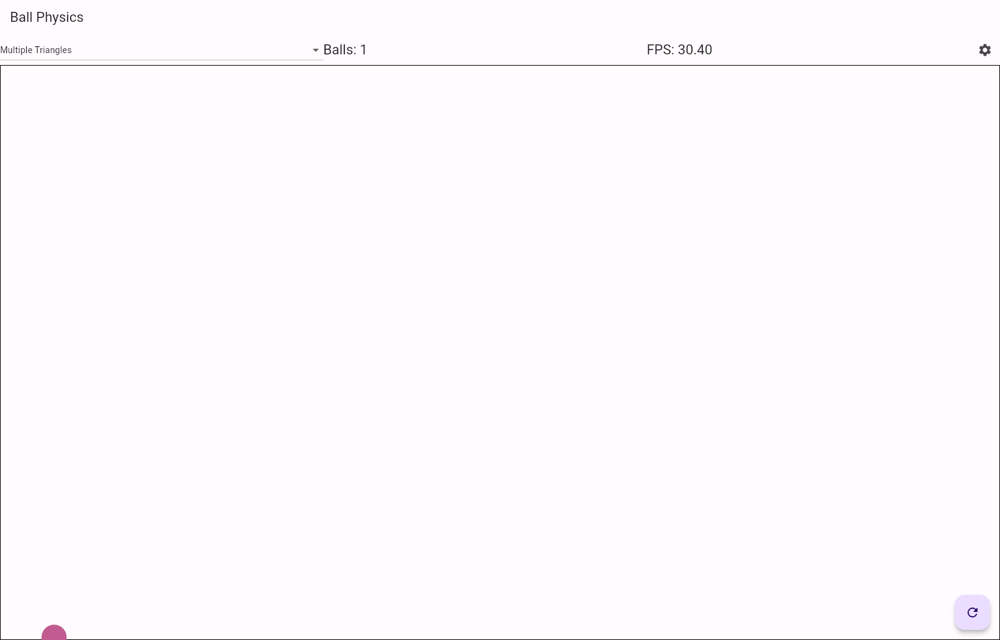

# Bouncy Ball Physics

## Overview
"Bouncy Ball Physics" is a Flutter application that demonstrates a physics-based animation of bouncing balls. This project showcases the capabilities of Flutter in creating dynamic and interactive animations, utilizing core concepts such as custom painting, animation controllers, and state management.

## Features
- **Dynamic Ball Animation**: Balls bounce around the screen, reflecting off the edges.
- **Physics Simulation**: Simple physics principles are applied to create realistic ball movements.
- **FPS Counter**: Displays the current frames per second, demonstrating the app's performance.
- **Ball Count Display**: Shows the number of balls currently on screen.
- **Responsive Design**: Adjusts to various screen sizes and orientations.
- **Reset Functionality**: A button to reset the animation and start afresh.

## Screenshots

| Trail Shape         | Desktop Screenshot                                     | Mobile Screenshot                                       |
|---------------------|--------------------------------------------------------|---------------------------------------------------------|
| Line                |      |         |
| Single Triangle     |  |  |
| Multiple Triangles  |  |  |

## Getting Started

### Prerequisites
- Flutter installed on your machine
- An IDE (like Android Studio or VS Code)
- An emulator or physical device to run the app

### Installation
1. Clone the repository to your local machine:
   ```
   git clone https://github.com/your-username/bouncy-ball-physics.git
   ```
2. Open the project in your preferred IDE.
3. Run the following command in the terminal to get the necessary packages:
   ```
   flutter pub get
   ```
4. Start the emulator or connect your device.
5. Run the app:
   ```
   flutter run
   ```

## Usage
Upon launching the app, you will see animated balls bouncing around the screen. The FPS and the number of balls are displayed at the top. Use the refresh button to reset the animation.

## Contributing
Contributions to "Bouncy Ball Physics" are welcome.

