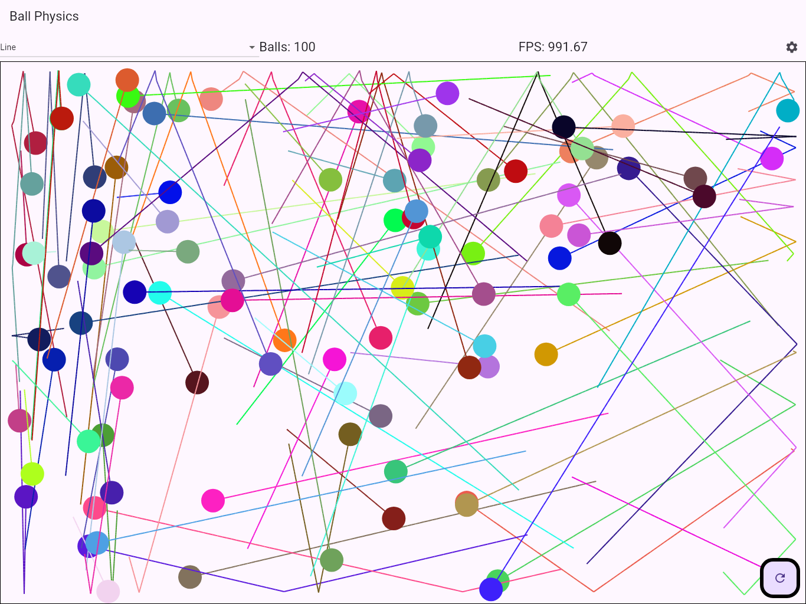
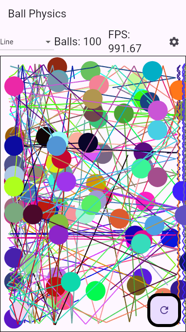
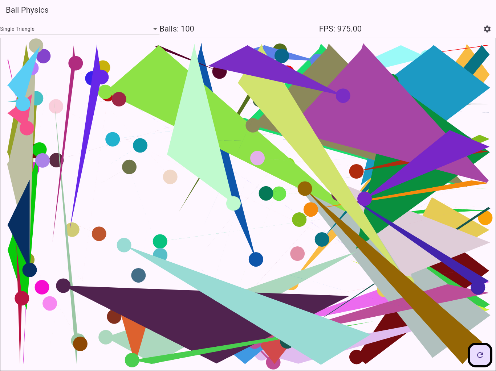
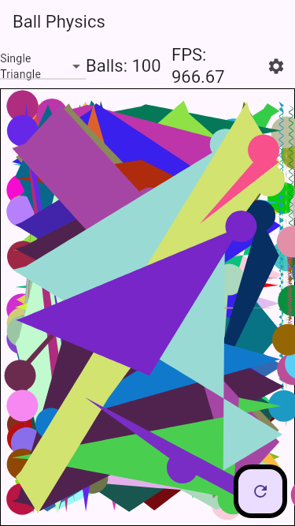
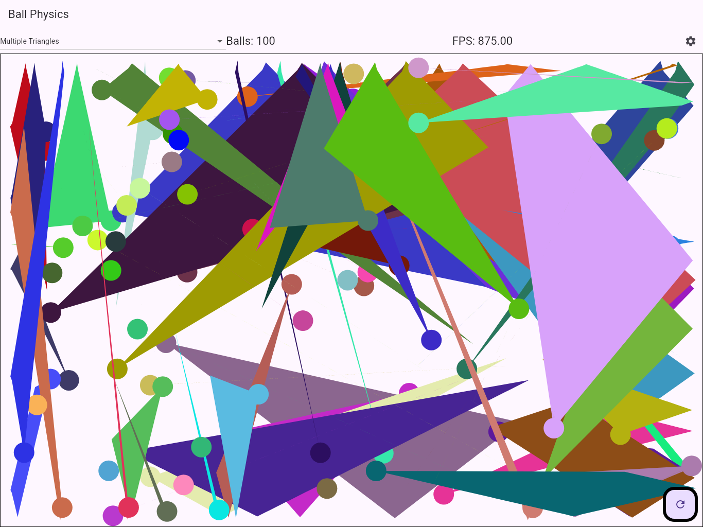
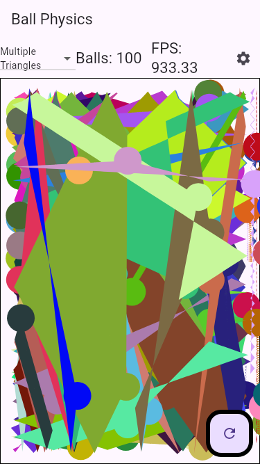

# Bouncy Ball Physics

## Overview
"Bouncy Ball Physics" is a Flutter application that demonstrates a physics-based animation of bouncing balls. This project showcases the capabilities of Flutter in creating dynamic and interactive animations, utilizing core concepts such as custom painting, animation controllers, and state management.

## Features
- **Dynamic Ball Animation**: Balls bounce around the screen, reflecting off the edges.
- **Physics Simulation**: Simple physics principles are applied to create realistic ball movements.
- **FPS Counter**: Displays the current frames per second, demonstrating the app's performance.
- **Ball Count Display**: Shows the number of balls currently on screen.
- **Responsive Design**: Adjusts to various screen sizes and orientations.
- **Reset Functionality**: A button to reset the animation and start afresh.

## Screenshots

| Trail Shape         | Desktop Screenshot                                                | Mobile Screenshot                                              |
|---------------------|-------------------------------------------------------------------|----------------------------------------------------------------|
| Line                |                     |                     |
| Single Triangle     |  |  |
| Multiple Triangles  |  |  |

## Getting Started

### Prerequisites
- Flutter installed on your machine
- An IDE (like Android Studio or VS Code)
- An emulator or physical device to run the app

### Installation
1. Clone the repository to your local machine:
   ```
   git clone https://github.com/abdelaziz-mahdy/bouncy-ball-physics.git
   ```
2. Open the project in your preferred IDE.
3. Run the following command in the terminal to get the necessary packages:
   ```
   flutter pub get
   ```
4. Start the emulator or connect your device.
5. Run the app:
   ```
   flutter run
   ```

## Usage
Upon launching the app, you will see animated balls bouncing around the screen. The FPS and the number of balls are displayed at the top. Use the refresh button to reset the animation.

## Renderers

The settings panel (gear icon) switches between three renderers that draw the same physics state:

| Mode | How it draws |
|------|--------------|
| Canvas (CPU) | `CustomPainter` with plain `Canvas` calls |
| Vertices (batched) | `CustomPainter` that triangulates every trail and ball into a few `Canvas.drawVertices` batches |
| flutter_scene (3D) | [`flutter_scene`](https://pub.dev/packages/flutter_scene) on Flutter GPU; balls are spheres, all trails share one updatable mesh |

Flutter GPU is enabled in the iOS/macOS `Info.plist` and the Android manifest. On Windows/Linux pass `--enable-flutter-gpu` to `flutter run`.

### Benchmark

```bash
tool/bench.sh                                   # every renderer x every load, best of 2
BENCH_MODES=canvas,vertices BENCH_LOADS=500x500 tool/bench.sh
```

The script runs a profile build with `--dart-define=BENCH=true`, which cycles the renderers through each load (8 s warm-up, 5 s measure, 3 s drain between runs), prints one `BENCH` line per cell and exits. It keeps the display awake with `caffeinate` and fronts the app window: macOS throttles occluded windows and a sleeping display, which silently cuts results by several times. Leave the window in front and the machine idle while it runs.

Apple Silicon MacBook, 120 Hz display, default window size, `Line` trails, best of 2, FPS:

| balls × tail | Canvas | Vertices | flutter_scene |
|-------------:|-------:|---------:|--------------:|
| 10 × 100     | 120.1  | 120.1    | 120.0         |
| 100 × 10     | 120.0  | 120.1    | 120.0         |
| 100 × 100    | 120.1  | 120.0    | 120.1         |
| 300 × 300    | 20.4   | 120.1    | 120.1         |
| 500 × 500    | 20.4   | 119.8    | 66.3          |
| 1000 × 100   | 16.1   | 120.0    | 109.8         |
| 1000 × 500   | 15.1   | 87.1     | 41.6          |
| 2000 × 100   | 19.4   | 120.0    | 75.4          |

Canvas issues one draw per ball, but Impeller still tessellates a stroke per segment, so it is raster-bound past a few tens of thousands of segments. Vertices and flutter_scene issue a handful of draws per frame regardless of load; flutter_scene additionally renders every ball as a 3D sphere mesh, which is where its remaining cost goes at high ball counts.

## Contributing
Contributions to "Bouncy Ball Physics" are welcome.

